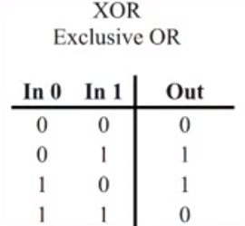
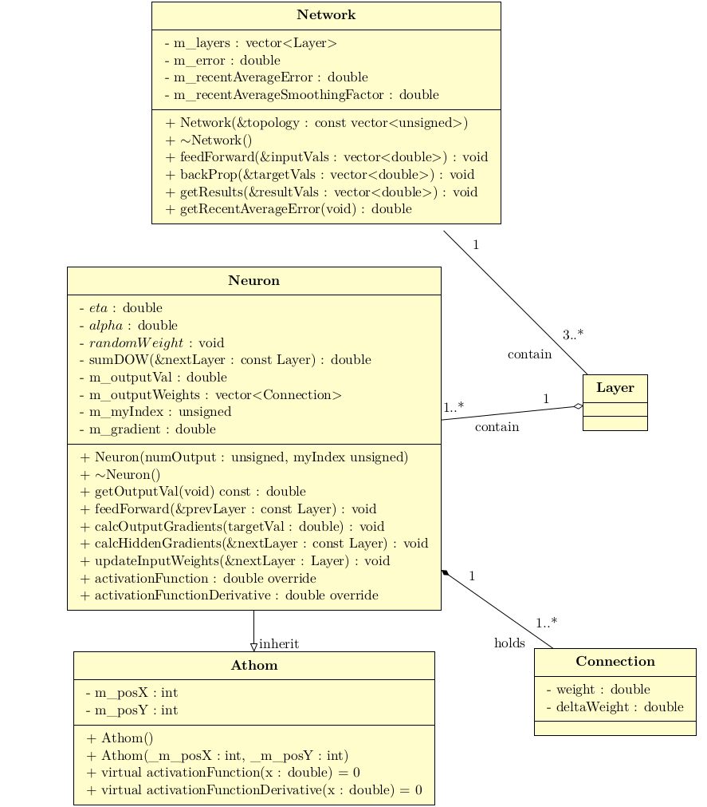
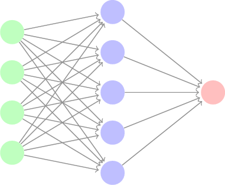
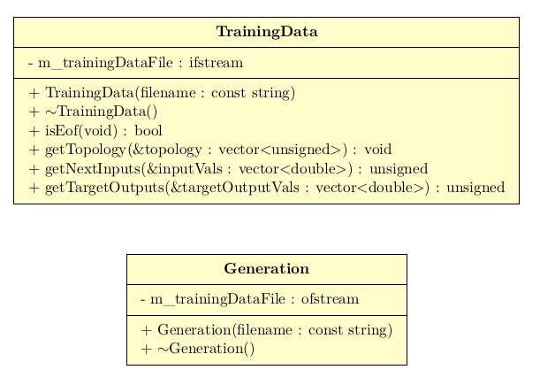

# CPPND: Capstone Neural Network from scratch in C++

The Capstone Project gives you a chance to integrate what you've learned throughout this program. This project will become an important part of your portfolio to share with current and future colleagues and employers.

In this project, you can build your own C++ application starting with this repo, following the principles you have learned throughout this Nanodegree Program. This project will demonstrate that you can independently create applications using a wide range of C++ features.

## Dependencies for Running Locally
* cmake >= 3.7
  * All OSes: [click here for installation instructions](https://cmake.org/install/)
* make >= 4.1 (Linux, Mac), 3.81 (Windows)
  * Linux: make is installed by default on most Linux distros
  * Mac: [install Xcode command line tools to get make](https://developer.apple.com/xcode/features/)
  * Windows: [Click here for installation instructions](http://gnuwin32.sourceforge.net/packages/make.htm)
* gcc/g++ >= 5.4
  * Linux: gcc / g++ is installed by default on most Linux distros
  * Mac: same deal as make - [install Xcode command line tools](https://developer.apple.com/xcode/features/)
  * Windows: recommend using [MinGW](http://www.mingw.org/)

## Basic Build Instructions

1. Clone this repo.
2. Make a build directory in the top level directory: `mkdir build && cd build`
3. Compile: `cmake .. && make`
4. Run it: `./NeuralNetwork`.

## Artificial Neural Network

A neural network or connection system are computer systems that are
inspiring but not identical to a biological neural network and named
of artificial neural network.

In an artificial neural network we can find elements such as examples:
 
* Layers (Input, Hidden, Output) 
* Neurons
* Connections

Our artificial neural network will learn from the information provided
by the user how to solve a problem whether it is easy, intermediate or difficult.

<u><b> Example :</b> </u> The exclusion operation <b>XOR</b> which returns <b>1</b> if both operators are
different and <b>0</b> if both are equal.

Then our input data is represented by the ordered pair A and B
and the result will be column A <b>XOR</b> B.

What an artificial neural network will do is predict the output value
based on any combination of input values ​​A and B.

## <b><u>Class Diagram:</u></b>

## <b><u>Structure of an Artificial Neural Network</u></b>

An artificial neural network (aka; <b>Network</b>) has associated layers
(aka; <b>Layer</b>) that are added or removed to the neural network using
the overloaded functions <b><i> addLayer</i> </b> that you receive as parameters
the layer or the layer and the index of the layer and <b><i>removeLayer</i> </b>
as parameters the index of the layer or the layer. In addition, a network
artificial neuronal calculates the error produced after processing the data of
the neural network and saves it in a member variable called <b> m_error </b> and
which is obtained by a class member function.

The behavior of our artificial neural network lies in performing the
following operations:
 
* A right processing or also called <b>feedForward</b> that
receive as a parameter the constant reference to a data type vector <i> double </i>
which represents the input data in each layer of our neural network.

* A reverse processing or also called <b>backPropagation</b> that
receive as a parameter the constant reference to a data type vector <i> double </i>
which represents the output data resulting from internal operations in each
neuron.

A layer (<b>Layer</b>) is made up of one or more neurons (<b>vector\<Neuron\></b>) that are added or
removed through the overloaded <b>addNeuron</b> functions it receives as
Parameter The Neuron or The Neuron and the Neuron index and <b>removeNeuron</b> that
it receives as parameter the Neuron or the index of the Neuron.

A Neuron has properties that do not change for any instance of the Nuron (e.g., <b><i>static</i> </b>) as
for example: The learning ratio (aka; <b>m_learningRate</b>),
angular momentum (aka; <b>momentum</b>).

For the specific case of the neuron, the calculation of the activation function is performed as
the tangent of the number and the calculation of the derivative activation function is performed as the
difference between one and the square of the number.

Our artificial neural network is complete because all neurons are connected to the
neurons in the next layer, such that a connection (aka; <b>Connection</b>) is part of the
Neurons.

A connection has as properties the weight (<b>m_weight</b>) and the weight delta (<b>m_deltaWeight</b>) which
they are updated in each iteration of our neural network consisting of a <b>feedForward</b> and
<b>backPropagation</b>.

##<b><u>Testing</u></b>

I have implemented the <b>TrainingData</b> class which handles the manipulation of 
our data for training.

The data training is created either using <b>/data/makeTrainingSamples.cpp</b>
or <b>Generation</b> class.

Thanks.